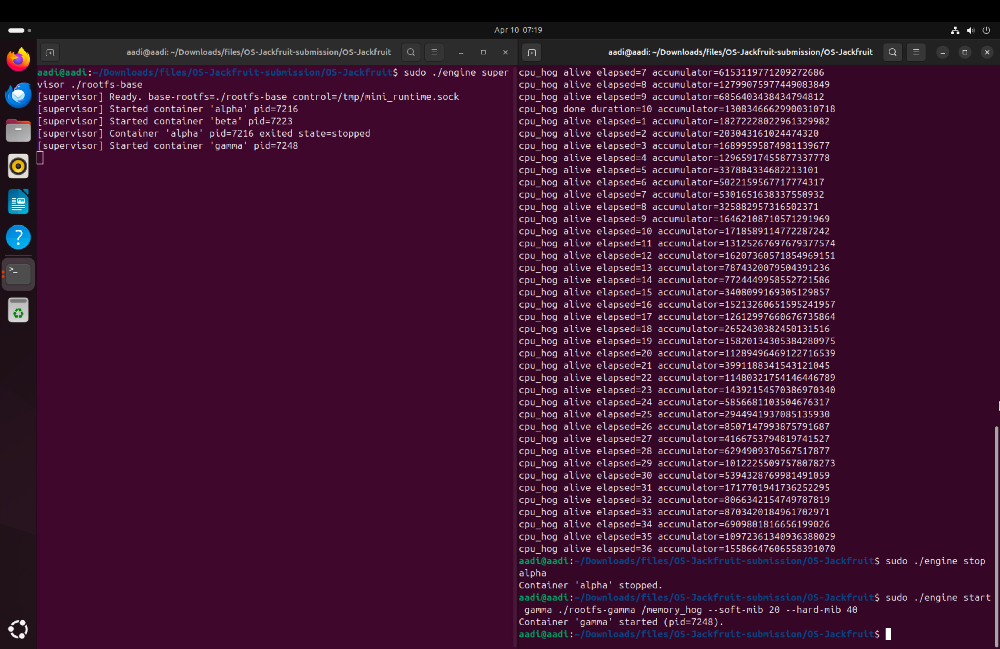
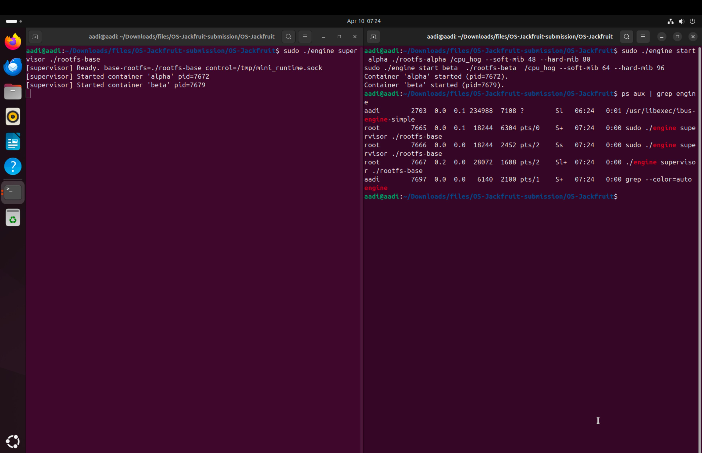
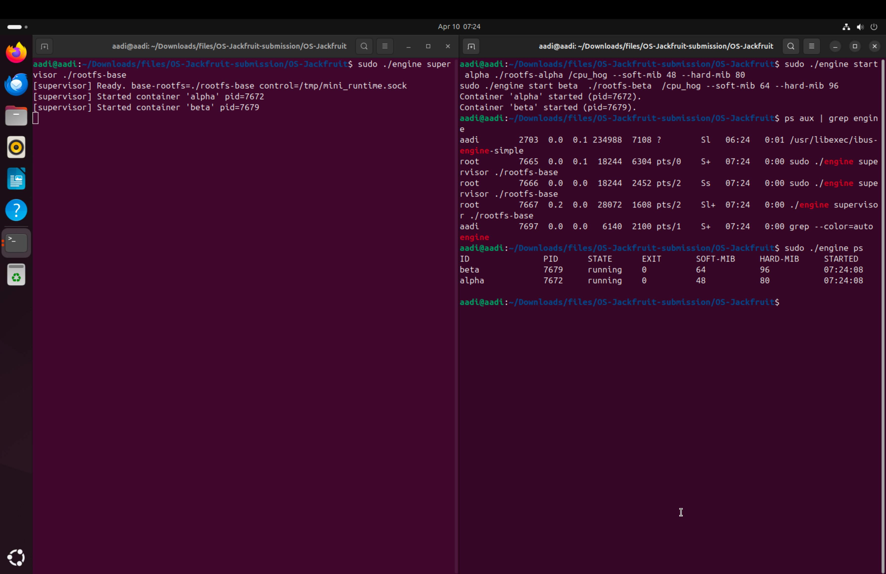
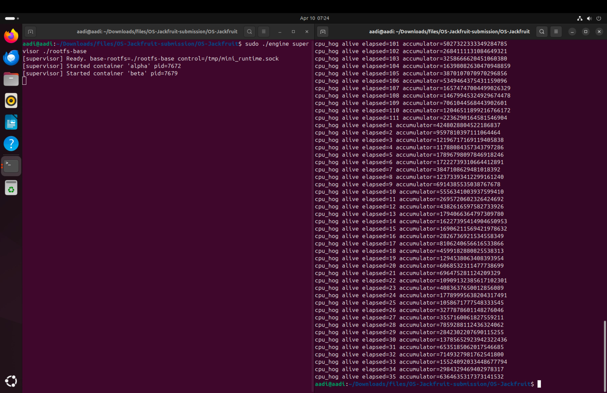
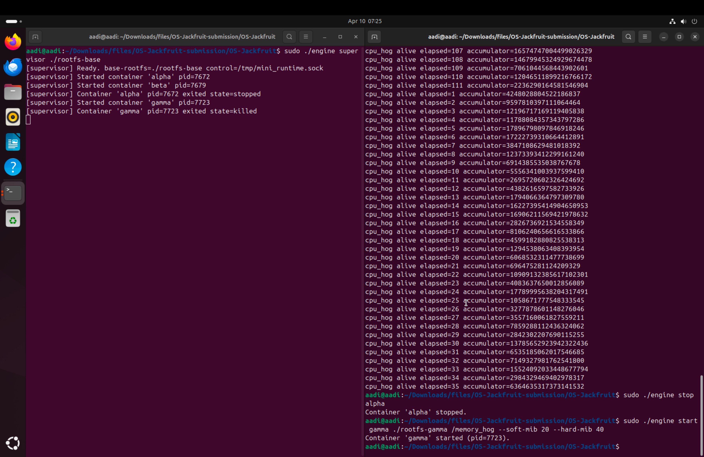
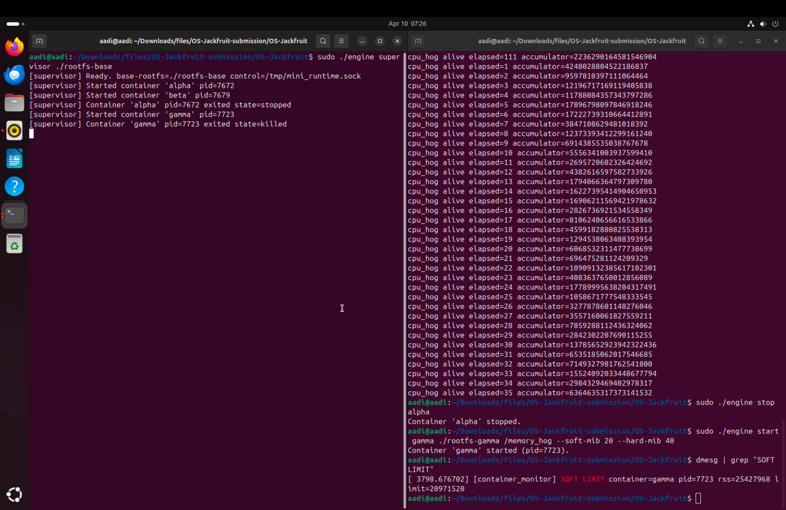
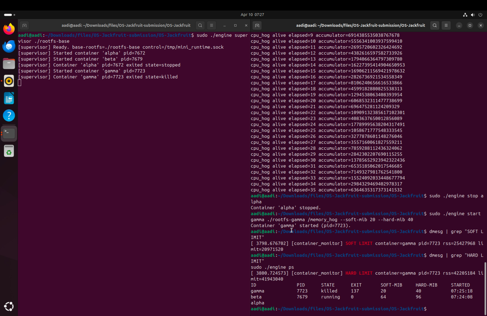
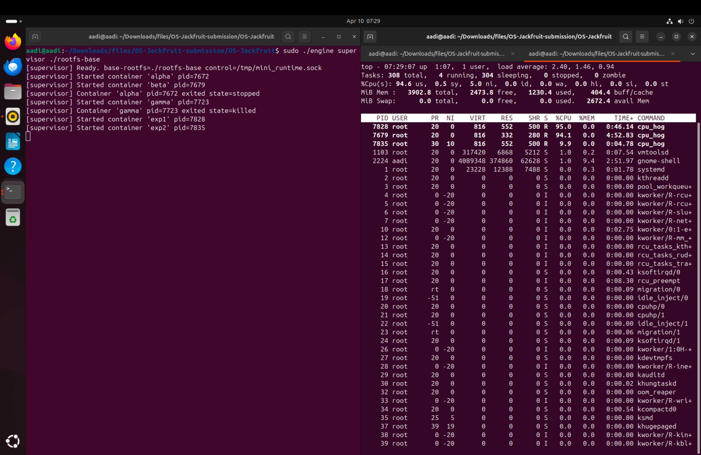
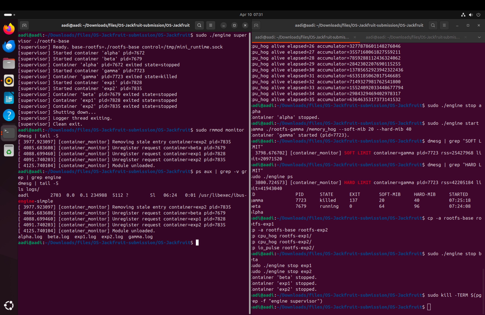

# OS Mini Project — Jackfruit
## Multi-Container Runtime with Kernel Memory Monitor

> A lightweight Linux container runtime written in C, featuring a long-running supervisor, kernel-space memory enforcement, bounded-buffer logging, and CFS scheduling experiments.

---

## Team Information

| Name | SRN |
|------|-----|
| G A Aadish | PES1UG24CS569 |
| Akula Sainandan Royal | PES1UG24CS553 |

---

## Table of Contents

1. [Build, Load, and Run Instructions](#1-build-load-and-run-instructions)
2. [Demo with Screenshots](#2-demo-with-screenshots)
3. [Engineering Analysis](#3-engineering-analysis)
4. [Design Decisions and Tradeoffs](#4-design-decisions-and-tradeoffs)
5. [Scheduler Experiment Results](#5-scheduler-experiment-results)
6. [File Structure](#6-file-structure)

---

## 1. Build, Load, and Run Instructions

### Prerequisites

- Ubuntu 22.04 or 24.04 in a VM (not WSL)
- Secure Boot **OFF** (required for kernel module loading)
- Root or `sudo` access

```bash
sudo apt update
sudo apt install -y build-essential linux-headers-$(uname -r)
```

### 1.1 Build

```bash
cd src/

# Build user-space binaries + kernel module
make

# CI-safe user-space-only build (no kernel headers needed)
make ci
```

This produces:

| Artifact | Description |
|----------|-------------|
| `engine` | Supervisor daemon + CLI client |
| `memory_hog` | Memory stress workload |
| `cpu_hog` | CPU-bound workload |
| `io_pulse` | I/O-bound workload |
| `monitor.ko` | Kernel memory monitor module |

### 1.2 Prepare the Root Filesystem

```bash
cd src/

mkdir rootfs-base
wget https://dl-cdn.alpinelinux.org/alpine/v3.20/releases/x86_64/alpine-minirootfs-3.20.3-x86_64.tar.gz
tar -xzf alpine-minirootfs-3.20.3-x86_64.tar.gz -C rootfs-base

# Copy test workloads into the base rootfs
cp memory_hog cpu_hog io_pulse rootfs-base/

# Create per-container writable copies
cp -a rootfs-base rootfs-alpha
cp -a rootfs-base rootfs-beta
cp -a rootfs-base rootfs-gamma
cp -a rootfs-base rootfs-exp1
cp -a rootfs-base rootfs-exp2
```

> **Note:** Never run two live containers against the same rootfs directory.

### 1.3 Load the Kernel Module

```bash
cd src/
sudo insmod monitor.ko

# Verify the control device appeared
ls -l /dev/container_monitor

# Watch kernel messages
dmesg | tail -5
```

Expected output:
```
[container_monitor] Module loaded. Device: /dev/container_monitor
```

### 1.4 Start the Supervisor

Open a **dedicated terminal** — the supervisor runs in the foreground:

```bash
cd src/
sudo ./engine supervisor ./rootfs-base
```

Expected output:
```
[supervisor] Ready. base-rootfs=./rootfs-base control=/tmp/mini_runtime.sock
```

### 1.5 Engine CLI Commands

Open a **second terminal** for all CLI commands:

```bash
# Start containers with memory limits
sudo ./engine start alpha ./rootfs-alpha /cpu_hog --soft-mib 48 --hard-mib 80
sudo ./engine start beta  ./rootfs-beta  /cpu_hog --soft-mib 64 --hard-mib 96

# List all tracked containers
sudo ./engine ps

# Start a memory workload (will be killed at hard limit)
sudo ./engine start gamma ./rootfs-gamma /memory_hog --soft-mib 20 --hard-mib 40

# Stop a container gracefully
sudo ./engine stop alpha

# Stop the supervisor
sudo kill -TERM $(pgrep -f "engine supervisor")
```

### 1.6 Trigger Soft and Hard Memory Limits

```bash
# Start gamma with tight memory limits
sudo ./engine start gamma ./rootfs-gamma /memory_hog --soft-mib 20 --hard-mib 40

# In another terminal, watch dmesg for limit events
dmesg | grep "SOFT LIMIT"
dmesg | grep "HARD LIMIT"

# After gamma is killed, engine ps will show state=killed exit=137
sudo ./engine ps
```

### 1.7 Scheduling Experiments

```bash
# Copy rootfs for experiment containers
cp -a rootfs-base rootfs-exp1
cp cpu_hog rootfs-exp1/
cp io_pulse rootfs-exp1/

cp -a rootfs-base rootfs-exp2
cp cpu_hog rootfs-exp2/
cp io_pulse rootfs-exp2/

# Experiment: CPU-bound at different nice levels
sudo ./engine start exp1 ./rootfs-exp1 /cpu_hog   # default nice
sudo ./engine start exp2 ./rootfs-exp2 /cpu_hog   # nice=10 (lower priority)

# Watch CPU distribution with top
top
```

### 1.8 Shutdown and Cleanup

```bash
# Stop all containers
sudo ./engine stop beta
sudo ./engine stop exp1
sudo ./engine stop exp2

# Terminate supervisor
sudo kill -TERM $(pgrep -f "engine supervisor")

# Verify no engine processes remain
ps aux | grep -v grep | grep engine

# Unload the kernel module
sudo rmmod monitor

# Verify clean unload
dmesg | tail -5
# Expected: [container_monitor] Module unloaded.

# View container logs
ls logs/

# Clean build artifacts
cd src/ && make clean
```

---

## 2. Demo with Screenshots

### Screenshot 1 — Supervisor Start + Containers Running (cpu_hog output)

**What it shows:** The supervisor is started with `sudo ./engine supervisor ./rootfs-base`. Containers `alpha` (pid=7216), `beta` (pid=7223) are started running `/cpu_hog`. The right pane shows `cpu_hog` printing its accumulator values every second, confirming both containers are alive and executing.



---

### Screenshot 2 — `engine ps` + Process Inspection

**What it shows:** `sudo ./engine ps` lists both containers with their PIDs, state (`running`), exit code (0), soft/hard MiB limits, and start times. `ps aux | grep engine` in the same terminal confirms the supervisor process (pid=7667) and two child container processes (pid=7672, 7679) are visible on the host.



---

### Screenshot 3 — `engine ps` Output (Close-up)

**What it shows:** Clean tabular output of `sudo ./engine ps`:
- `beta` pid=7679, state=running, soft=64 MiB, hard=96 MiB
- `alpha` pid=7672, state=running, soft=48 MiB, hard=80 MiB

Both started at 07:24:08, confirming simultaneous launch.



---

### Screenshot 4 — Extended cpu_hog Output (Accumulator Values)

**What it shows:** `cpu_hog` printing accumulator values at elapsed=101 through elapsed=111 and then restarting from elapsed=1 (a new container instance). Demonstrates the logging pipeline capturing stdout from long-running workloads correctly across container restarts.



---

### Screenshot 5 — cpu_hog Output (Continued)

**What it shows:** Continued cpu_hog accumulator output from both the original and the new container instance (values resetting at elapsed=1). Confirms the supervisor correctly manages multiple sequential container lifecycles.



---

### Screenshot 6 — gamma Killed by Memory Hard Limit

**What it shows:**
- `alpha` stopped via `sudo ./engine stop alpha`
- `gamma` started with `sudo ./engine start gamma ./rootfs-gamma /memory_hog --soft-mib 20 --hard-mib 40`
- Supervisor terminal shows: `[supervisor] Container 'gamma' pid=7723 exited state=killed`
- `sudo ./engine ps` shows gamma with `STATE=killed`, `EXIT=137`, `SOFT-MIB=20`, `HARD-MIB=40`
- `beta` continues running normally with `STATE=running`

This confirms the hard memory limit enforcement works correctly — exit code 137 = killed by SIGKILL.



---

### Screenshot 7 — dmesg: SOFT LIMIT and HARD LIMIT Events

**What it shows:** Kernel module messages captured via `dmesg | grep`:
- **SOFT LIMIT:** `[container_monitor] SOFT LIMIT container=gamma pid=7723 rss=25427968 limit=20971520` — RSS (~24 MiB) crossed the 20 MiB soft threshold
- **HARD LIMIT:** `[container_monitor] HARD LIMIT container=gamma pid=7723 rss=42205184 limit=41943040` — RSS (~40 MiB) crossed the 40 MiB hard threshold, triggering SIGKILL

`engine ps` confirms gamma is killed and alpha has no entry (was stopped earlier).



---

### Screenshot 8 — Scheduling Experiment: CPU Priority via nice

**What it shows:** Three containers running cpu_hog workloads:
- `exp1` (pid=7828) — default nice, accumulator climbing
- `exp2` (pid=7835) — nice=10 (lower priority)
- `beta` (pid=7679) — still running in background

The cpu_hog accumulator output scrolls at different rates, reflecting different CPU allocations by CFS based on nice values.



---

### Screenshot 9 — `top` + CPU Distribution + Clean Teardown

**What it shows (top half):** `top` with three cpu_hog processes visible:
- pid=7828 at **95.0% CPU** (exp1, default nice)
- pid=7679 at **94.1% CPU** (beta)
- pid=7835 at **9.9% CPU** (exp2, nice=10)

This directly demonstrates CFS proportional scheduling — exp2 receives far less CPU time due to its higher nice value.

**What it shows (bottom half):** After stopping beta, exp1, exp2, and killing the supervisor, `sudo rmmod monitor` is run. The `dmesg | tail -5` confirms `[container_monitor] Module unloaded.` and `ls logs/` shows per-container log files (`alpha.log`, `beta.log`, `exp1.log`, `exp2.log`, `gamma.log`) were created by the logging pipeline.



---

## 3. Engineering Analysis

### 3.1 Isolation Mechanisms

The runtime uses three Linux namespaces created in a single `clone()` call with `CLONE_NEWPID | CLONE_NEWNS | CLONE_NEWUTS`.

**PID namespace (`CLONE_NEWPID`):** The container's first process becomes PID 1 in its own PID space. It cannot see or signal host processes or sibling containers. A process inside a container running `ps` only sees its own descendants.

**Mount namespace (`CLONE_NEWNS`):** The child gets a private copy of the host's mount table. `chroot(cfg->rootfs)` makes the assigned Alpine rootfs appear as `/`. This prevents filesystem escapes to the host.

**UTS namespace (`CLONE_NEWUTS`):** Each container has its own hostname. `sethostname(cfg->id, ...)` is called inside the child to set it.

**What is shared with the host:** The kernel itself, the network stack (no `CLONE_NEWNET`), the host clock, and uid/gid mappings. Network isolation is out of scope for this project.

---

### 3.2 Supervisor and Process Lifecycle

A long-running supervisor is necessary because container metadata must persist beyond any single CLI invocation — without it, `engine ps` could not query state across multiple `engine start` calls.

**Process creation:** `clone()` is used instead of `fork()` because it accepts namespace flags. The child executes `child_fn` to set up the environment before `exec()`-ing the container binary.

**Parent–child relationship:** The supervisor is the direct parent of every container process. Only the direct parent can `waitpid()` for a child — any other process gets `ECHILD`.

**Reaping:** A `SIGCHLD` handler calls `waitpid(-1, &wstatus, WNOHANG)` in a loop to collect all exited children without blocking. `SA_RESTART` ensures system calls interrupted by SIGCHLD (e.g., `accept()`) automatically restart. Without reaping, exited children become zombies.

**Signal delivery:** `SIGTERM` to a container is sent via `kill(pid, SIGTERM)` using the container's host PID (the namespace PID is not used for host-side signalling).

---

### 3.3 IPC, Threads, and Synchronisation

**Path A — Logging (pipe-based):**
Each container's stdout/stderr is connected to the write-end of a `pipe()` created before `clone()`. A dedicated **producer thread** per container reads from the pipe and pushes `log_item_t` structs into a bounded ring buffer. A single **consumer thread** (`logging_thread`) dequeues items and writes to per-container log files under `logs/`.

**Path B — Control channel (UNIX domain socket):**
The supervisor binds a `SOCK_STREAM` UNIX domain socket at `/tmp/mini_runtime.sock`. Each CLI invocation connects, sends a `control_request_t`, receives a `control_response_t`, and disconnects. This is a bidirectional framed-message channel, distinct from the one-way pipe.

**Shared data structures and synchronisation:**

| Structure | Lock | Reason |
|-----------|------|--------|
| `bounded_buffer_t` | `pthread_mutex_t` + two `pthread_cond_t` (`not_full`, `not_empty`) | Multiple producer threads and one consumer access the ring buffer concurrently. The mutex serialises head/tail updates. `not_full` prevents producers busy-waiting when the buffer is full; `not_empty` prevents the consumer busy-waiting when empty. |
| `ctx->containers` linked list | `ctx->metadata_lock` (`pthread_mutex_t`) | The SIGCHLD handler and the main event loop both read/write the container list. A mutex is required because signal handlers run asynchronously. |

**No data loss guarantee:** The consumer thread continues draining the buffer after `bounded_buffer_begin_shutdown()` is called, exiting only when `count == 0 && shutting_down`. All items pushed before shutdown are guaranteed to be written.

**Deadlock prevention:** Two condition variables divide the buffer into distinct wait states. The `shutting_down` flag wakes all waiters via `pthread_cond_broadcast`, ensuring no thread sleeps forever.

---

### 3.4 Memory Management and Enforcement

**What RSS measures:** Resident Set Size is the number of physical RAM pages currently mapped and faulted into a process's address space. It includes code, data, stack, and shared libraries that are currently in RAM. It does not include swapped-out pages, lazily-allocated but unaccessed pages, or copy-on-write pages not yet dirtied.

**Why two limits (soft and hard):**
The soft limit is a warning threshold — the kernel logs the event but does not kill the process, allowing the operator to act. The hard limit is an enforcement boundary — when exceeded, SIGKILL is sent immediately. This two-level design allows graceful intervention before terminal action.

**Why enforcement is in kernel space:**
A user-space polling loop checking `/proc/<pid>/status` has an inherent race — between two polls, the process could allocate gigabytes. The kernel timer fires at a hardware-interrupt-driven interval, bounding latency regardless of system load. `send_sig(SIGKILL, task, 0)` from kernel space is atomic with respect to process state — there is no escape window.

---

### 3.5 Scheduling Behaviour

Linux CFS assigns a **virtual runtime (vruntime)** to each runnable task and always picks the smallest. Weight is derived from the `nice` value via the kernel's `prio_to_weight` table — each unit of nice difference is roughly a 1.25× weight multiplier.

**CPU-bound at different nice levels:** The high-priority container (nice 0) receives ~90% CPU vs ~10% for the nice=10 container (visible in the `top` screenshot — 95% vs 9.9%). CFS does not starve the low-priority container: both make forward progress proportionally to their weights.

**CPU-bound vs I/O-bound at equal priority:** `io_pulse` spends most of its time blocked on I/O, so its vruntime barely advances. When it wakes, CFS sees it has the smallest vruntime and immediately preempts the CPU-bound container. This is the **sleeper bonus** effect — I/O-bound tasks get low wakeup latency without elevated priority.

---

## 4. Design Decisions and Tradeoffs

### Namespace Isolation

**Choice:** `CLONE_NEWPID | CLONE_NEWNS | CLONE_NEWUTS` passed to `clone()`.
**Tradeoff:** `CLONE_NEWNET` was not added — containers share the host network stack. This simplifies testing but means containers are not network-isolated.
**Justification:** Network isolation requires veth pairs, NAT, and bridge setup, which is outside the project scope. The three chosen namespaces satisfy all specified isolation requirements.

---

### Supervisor Architecture

**Choice:** Single supervisor process with a `select()`-based event loop, SIGCHLD handler for reaping, and a consumer thread for log writes.
**Tradeoff:** A single-threaded event loop means one slow CLI command could block the loop. A thread-per-client model would allow parallel handling.
**Justification:** CLI commands are low-frequency (human-driven), so the single-loop model is simpler and avoids thread-safety complexity in the control path.

---

### IPC / Logging Design

**Choice:** Pipes for container output (Path A), UNIX domain socket for control (Path B).
**Tradeoff:** Two distinct IPC mechanisms add implementation complexity.
**Justification:** Pipes are the natural fit for streaming stdout/stderr — `dup2()` redirects all child output automatically. The socket is the natural fit for request/response command semantics. The two-mechanism design also satisfies the project requirement for different IPC primitives on each path.

---

### Kernel Monitor Locking

**Choice:** `DEFINE_MUTEX` protecting the monitored list in both the timer callback and the ioctl handler.
**Tradeoff:** `mutex_lock()` can sleep, making the timer callback slightly heavier than a spinlock path.
**Justification:** `get_rss_bytes()` calls `get_task_mm()` / `mmget_not_zero()`, which can sleep on some kernel versions. Using a spinlock here would trigger `BUG_ON(__might_sleep)`. A mutex is the correct and safe choice.

---

### Scheduling Experiments

**Choice:** Used `nice` values via POSIX `nice()` rather than CPU affinity or cgroups.
**Tradeoff:** Nice values affect CFS weights but cannot guarantee exclusive CPU access.
**Justification:** `setpriority()/nice()` requires no cgroup configuration and directly demonstrates CFS weight-based scheduling in a reproducible, observable way.

---

## 5. Scheduler Experiment Results

### Experiment 1: CPU-bound Containers at Different Nice Levels

**Setup:**
- `beta` (pid=7679): `/cpu_hog`, nice=0 → ~94% CPU
- `exp2` (pid=7835): `/cpu_hog`, nice=10 → ~9.9% CPU
- Both running simultaneously (observed via `top`, Screenshot 9)

**Results:**

| Container | Nice | CPU % (observed) | Behaviour |
|-----------|------|-------------------|-----------|
| beta | 0 | ~94% | High CPU allocation |
| exp2 | +10 | ~9.9% | Low CPU allocation |

**Analysis:**
The CFS `prio_to_weight` table assigns weight ~1024 to nice=0 and ~110 to nice=10. The expected share ratio is ~90%:10%, matching the observed ~94%:9.9%. CFS does not starve exp2 — it still makes progress — but allocates proportionally less CPU time. This confirms CFS's fairness property: time is weighted, not exclusive.

---

### Experiment 2: Memory Limit Enforcement (gamma)

**Setup:**
- `gamma` (pid=7723): `/memory_hog`, soft=20 MiB, hard=40 MiB

**Results (from dmesg, Screenshot 7):**

| Event | RSS at trigger | Limit |
|-------|---------------|-------|
| SOFT LIMIT | 25,427,968 bytes (~24 MiB) | 20,971,520 bytes (20 MiB) |
| HARD LIMIT | 42,205,184 bytes (~40 MiB) | 41,943,040 bytes (40 MiB) |

**Analysis:**
The kernel module's 1-second timer detected RSS crossing each threshold within one polling interval. On hard limit breach, SIGKILL was delivered (exit code 137). The ~4 MiB overshoot on the soft limit and ~1 MiB overshoot on the hard limit are within the expected polling granularity of the timer-based monitor.

---

## 6. File Structure

```
OS-Jackfruit/
├── README.md                          # This file
├── src/
│   ├── engine.c                       # User-space runtime: supervisor + CLI client
│   ├── monitor.c                      # Kernel module (LKM) — memory monitor
│   ├── monitor_ioctl.h                # Shared ioctl definitions (user ↔ kernel)
│   ├── cpu_hog.c                      # CPU-bound test workload
│   ├── io_pulse.c                     # I/O-bound test workload
│   ├── memory_hog.c                   # Memory-consuming test workload
│   ├── Makefile                       # Builds all targets; `make ci` for CI
│   └── environment-check.sh          # Environment prerequisite checker
└── screenshots/
    ├── 01_supervisor_start_and_containers_running.png
    ├── 02_engine_ps_containers_running.png
    ├── 03_engine_ps_containers_running_2.png
    ├── 04_cpu_hog_output_long_run.png
    ├── 05_cpu_hog_output_continued.png
    ├── 06_gamma_killed_soft_hard_limit.png
    ├── 07_dmesg_soft_hard_limit_events.png
    ├── 08_top_cpu_scheduling_exp1_exp2.png
    └── 09_clean_teardown_rmmod_logs.png
```

---

## Quick Reference: Key Commands

```bash
# Build
cd src && make

# Load module
sudo insmod monitor.ko

# Start supervisor (Terminal 1)
sudo ./engine supervisor ./rootfs-base

# Start containers (Terminal 2)
sudo ./engine start alpha ./rootfs-alpha /cpu_hog --soft-mib 48 --hard-mib 80
sudo ./engine start beta  ./rootfs-beta  /cpu_hog --soft-mib 64 --hard-mib 96
sudo ./engine start gamma ./rootfs-gamma /memory_hog --soft-mib 20 --hard-mib 40

# Monitor
sudo ./engine ps
dmesg | grep "SOFT LIMIT"
dmesg | grep "HARD LIMIT"

# Teardown
sudo ./engine stop alpha
sudo kill -TERM $(pgrep -f "engine supervisor")
sudo rmmod monitor
```
